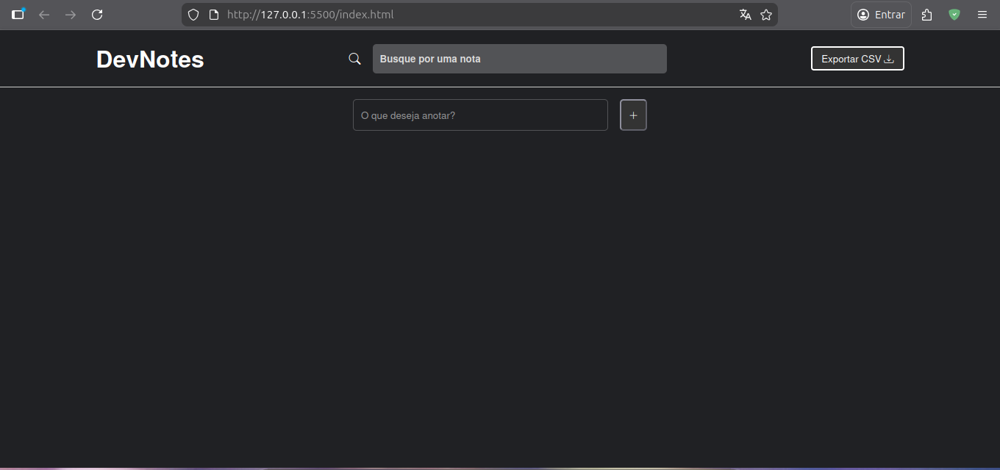
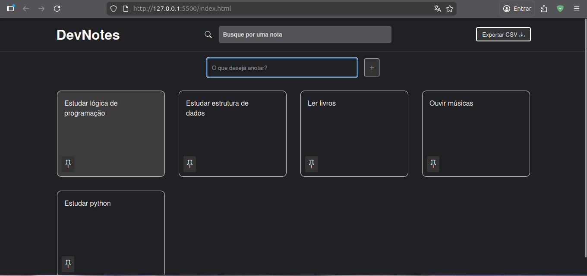
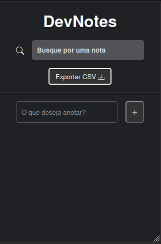
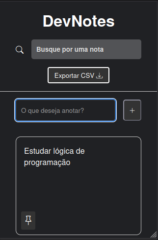

# DevNotes 📝

DevNotes is a simple and efficient note-taking web application designed for developers to quickly jot down and manage their thoughts, code snippets, or any other important information. The application allows users to create, delete, and search for notes, as well as export them to a CSV file.

## 🚀 Technologies Used

- **HTML5**: For structure and semantic content.
- **CSS3**: For custom styling and layout.
- **JavaScript (Vanilla)**: For application logic and local storage management.
- **Bootstrap Icons**: For modern and intuitive iconography.

## 📁 Project Structure

```text
.
├── README.md
├── assets
│   ├── css
│   │   └── styles.css
│   └── js
│       └── scripts.js
└── index.html
```

## 🛠️ How to Run the Project

### With Live Server (Recommended)

If you are using **VS Code**, you can use the **Live Server** extension for a better development experience:

1. Open the project folder in VS Code.
2. Click on the **"Go Live"** button in the status bar (bottom right).
3. The application will automatically open in your default browser at `http://127.0.0.1:5500/index.html`.

### Without Live Server

You can also run the project by simply opening the `index.html` file:

1. Navigate to the project's root directory.
2. Double-click on the `index.html` file or drag and drop it into any modern web browser.

## 📸 Screenshots

### Desktop View





### Mobile View




